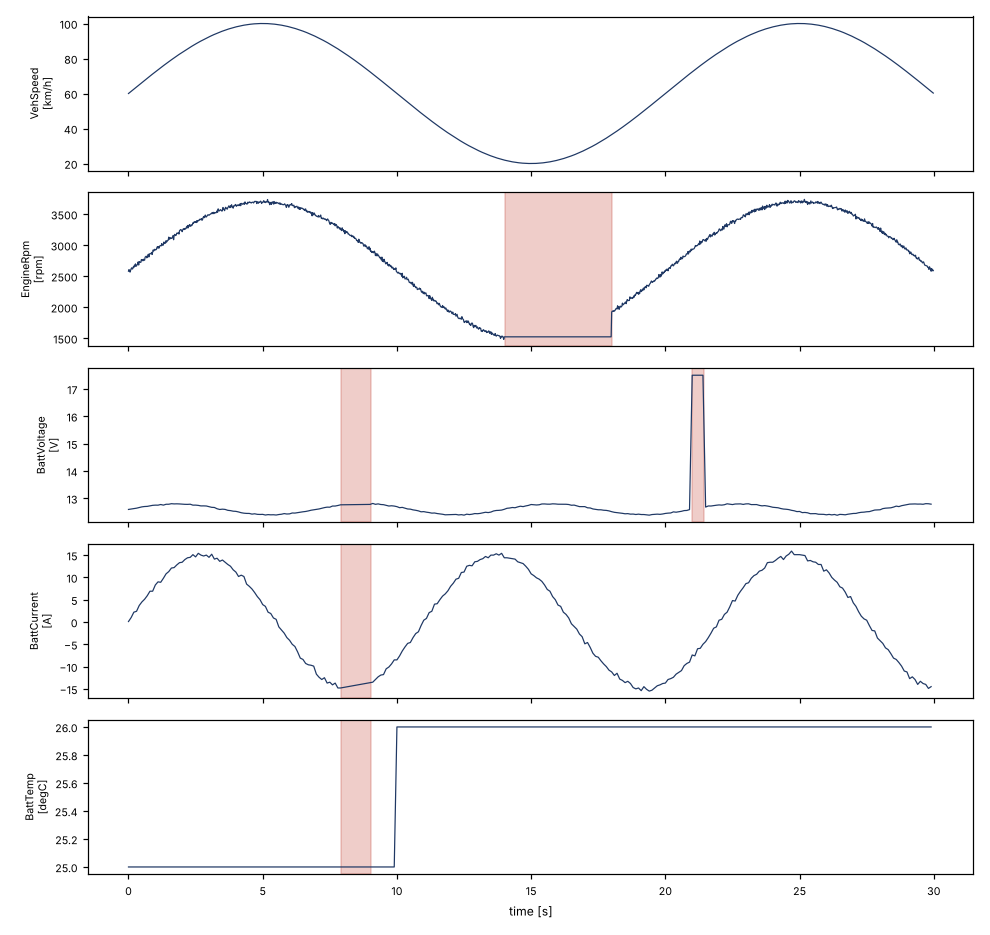

# ee-test-data-toolkit

A small Python toolkit for acquiring, decoding and validating E/E (electrical/electronic) test data from a CAN network. Everything runs against a simulated ECU network, so it works on any laptop without hardware.

<p align="center">
  
</p>

The plot above is a 30 second simulated drive with four injected faults. The toolkit finds all of them and marks them in red.

## Why I built this

Validation engineers spend a lot of time on the same chain of steps: record raw bus traffic, decode it into physical signals, check the signals against rules, and write up what went wrong. I wanted to build that whole chain once, end to end, with tests, so I could see where the tricky parts are. Bit-level decoding and deciding what counts as a "fault" turned out to be the interesting bits.


1. **Signal database** (`config/vehicle_signals.json`): messages and signals with start bit, length, factor, offset, signedness, unit and valid range. It is a small JSON format in the spirit of a DBC file.
2. **Decoding** (`ee_toolkit/signals.py`): encodes and decodes CAN frames for little-endian (Intel) layouts, including sub-byte signals like a 4-bit counter.
3. **Acquisition** (`ee_toolkit/acquisition.py`): writes frames to a CSV log and reads them back. A `FrameSource` interface marks the place where a real bus adapter (for example `python-can`) would plug in. Only the simulated source is implemented.
4. **Simulator** (`ee_toolkit/simulator.py`): a seeded ECU network with a powertrain message (20 ms) and a battery message (100 ms). It can inject faults: message dropouts, stuck signals, out-of-range values and alive-counter jumps.
5. **Validation** (`ee_toolkit/validation.py`): four rules.
   - range check against the limits in the signal database
   - cycle time check (flags gaps longer than 1.5 times the expected cycle)
   - stuck signal check (value constant for 2 s or longer)
   - alive counter check (must increase by 1, with wraparound)
6. **Report** (`ee_toolkit/report.py`): a self-contained HTML file with a verdict, a violation table and plots with the faults highlighted. See `results/report.html`.

## Usage

```bash
pip install -r requirements.txt

# record a 30 s simulated drive with the demo faults
python -m ee_toolkit simulate --out logs/demo.csv

# validate it (exit code 1 if any rule fails, so it works in CI)
python -m ee_toolkit validate logs/demo.csv

# write an HTML report
python -m ee_toolkit report logs/demo.csv --out results/report.html

# a clean run without faults passes
python -m ee_toolkit simulate --faults none --out logs/clean.csv
python -m ee_toolkit validate logs/clean.csv
```

Output for the demo log:

```
[cycle_time] Battery 7.90-9.00s: gap 1100 ms, expected 100 ms
[stuck] EngineRpm 14.02-17.98s: value constant at 1523 for 4.0 s
[range] BattVoltage 21.00-21.40s: 5 samples outside [9.0, 16.0], e.g. 17.5 V
[counter] AliveCounter 24.98-25.00s: counter step of 4, expected 1
[counter] AliveCounter 25.00-25.02s: counter step of 14, expected 1
FAIL (5 violations)
```

The counter fault shows up twice because the counter jumps when the fault starts and again when it ends.

## Tests

```bash
pytest -v
```

21 tests cover encode/decode round trips (signed values, offsets, sub-byte signals), reproducibility of the simulator, each validation rule including edge cases (counter wraparound, a stuck period that is too short to flag), malformed and unknown frames, the CSV log round trip, and the CLI exit codes. GitHub Actions runs the tests plus an end-to-end check: the clean log must pass and the faulty log must fail.

## Limitations and next steps

- Only simulated data. A `python-can` adapter implementing `FrameSource` would be the first real extension.
- Only little-endian signal layouts, no multiplexed signals and no CAN FD.
- The signal database is a custom JSON format. Reading real DBC files (for example with `cantools`) would be the natural next step.
- Validation rules are fixed in code. Making them configurable per signal in the database would make the tool more reusable.
- There is no GUI. The HTML report is the only visual output.

## License

MIT, see `LICENSE`.
